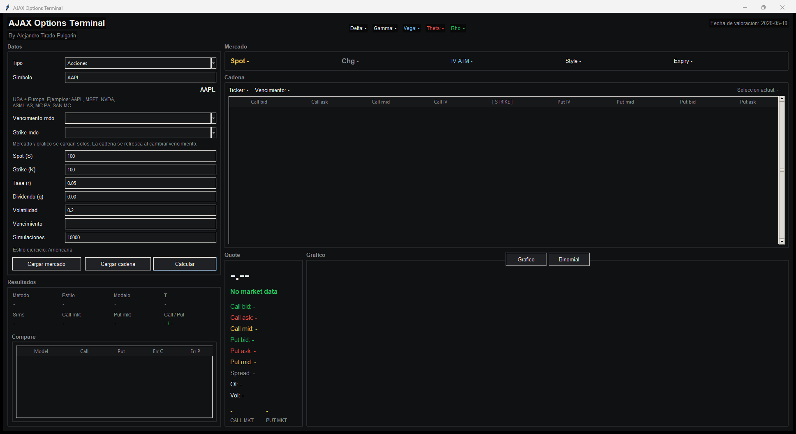

# AJAX Options Terminal

[](https://www.python.org/)
[](https://docs.python.org/3/library/tkinter.html)
[](https://pypi.org/project/yfinance/)
[](#limitations--disclaimer)

**AJAX = Applied Joint Analytics eXecution**

## Project Summary

AJAX Options Terminal is a Python desktop application for options valuation, Greeks analysis and model comparison, integrating market data, option chain inspection and Black-Scholes, Binomial CRR and Monte Carlo pricing engines.

It is designed as a compact derivatives pricing and market data desktop tool for exploring how theoretical option values compare with observable market quotes across different underlyings, expiries and strikes. The project is actively evolving, and some modelling details are still simplified or partially implemented.

## Preview



Desktop interface preview. Replace `docs/screenshot.png` with a populated market-data capture when available.

## Overview

AJAX Options Terminal provides a desktop workflow for loading market data, inspecting option chains and comparing theoretical option prices against market mid prices. The interface is built around practical pricing tasks: select an underlying, load expiries and strikes, inspect quoted bid/ask/mid data, calculate theoretical values and review Greeks.

The project is suitable for demonstrating Python, derivatives pricing fundamentals, public market data integration and markets automation workflows in a recruiter-friendly portfolio or CV context. It is an educational prototype and research-oriented options valuation terminal under development; it does not execute orders or manage positions.

## Key Features

- Python desktop GUI built with `tkinter`
- Market data and option chain loading through `yfinance`
- Underlying search with Yahoo Finance ticker suggestions
- Option chain inspection by expiry and strike
- Comparison between theoretical prices and market mid prices
- Black-Scholes, Binomial CRR and Monte Carlo pricing outputs
- Greeks analysis for options risk sensitivities
- Pricing error and model comparison outputs
- In-panel binomial tree view
- Automatic loading of spot price, dividend yield reference, implied volatility reference, expiries, strikes and underlying chart
- Risk-free rate proxy selection using public market tickers where available
- Console fallback when `tkinter` is unavailable

## Pricing Models

The pricing layer compares several standard option valuation approaches:

- **Black-Scholes**: European option pricing reference model.
- **Binomial CRR**: Cox-Ross-Rubinstein lattice model used as the primary model for American-style exercise assumptions.
- **Monte Carlo**: Simulation-based European reference engine for model comparison.

The application calculates all three model outputs and then identifies a primary model based on inferred exercise style:

- European-style assets: Black-Scholes is treated as the primary model.
- American-style assets: Binomial CRR is treated as the primary model.
- Monte Carlo and Black-Scholes outputs remain visible as reference points for comparison.

This setup is intended to make model assumptions transparent rather than hiding alternative valuation methods. The European/American classification is currently heuristic and not a complete exchange-level contract specification engine, so exercise-style handling should be treated as an area for further development.

## Example Workflow

1. Enter an equity ticker.
2. Load the underlying market snapshot.
3. Select an option expiry and strike.
4. Inspect calls, puts and market mid prices.
5. Compare Black-Scholes, Binomial CRR and Monte Carlo theoretical values.
6. Review Greeks, pricing error and sensitivity outputs.

## Tech Stack

- **Language**: Python
- **Desktop UI**: `tkinter`
- **Market Data**: `yfinance`
- **Charts**: `matplotlib`
- **Packaging**: PyInstaller scripts for macOS and Windows builds

## Installation

Clone the repository and install dependencies:

```bash
git clone https://github.com/alex1999tirado-cpu/AJAX-Trading-Simulator-Station.git
cd AJAX-Trading-Simulator-Station
pip install -r requirements.txt
```

If your system uses `python3`/`pip3`, use:

```bash
python3 -m pip install -r requirements.txt
```

## Usage

Launch the desktop application:

```bash
python main.py
```

On macOS or Linux, depending on your environment:

```bash
python3 main.py
```

If the current Python environment does not include `tkinter`, the project falls back to a simple console mode.

## Project Structure

```text
.
|-- main.py
|-- pricer/
|   |-- blackscholes.py
|   |-- binomial.py
|   |-- engine.py
|   |-- marketdata.py
|   `-- montecarlo.py
|-- docs/
|   `-- README.md
|-- requirements.txt
|-- build_macos_app.sh
|-- build_windows_exe.bat
|-- build_windows_exe.ps1
|-- AJAX Options Terminal.spec
`-- .github/workflows/build-desktop.yml
```

## Build Desktop Apps

The repository includes optional packaging scripts for desktop builds.

macOS:

```bash
python3 -m pip install -r requirements.txt pyinstaller
./build_macos_app.sh
```

Windows:

```powershell
python -m pip install -r requirements.txt pyinstaller
.\build_windows_exe.ps1
```

The GitHub Actions workflow at `.github/workflows/build-desktop.yml` can also be used for automated desktop builds.

## CV Description

**AJAX Options Terminal - Derivatives Pricing & Market Data Tool**

Developed a Python desktop application for options valuation, Greeks analysis and model comparison, integrating market data loading, option chain inspection and Black-Scholes, Binomial CRR and Monte Carlo pricing engines.

## Limitations / Disclaimer

- Market data is sourced from `yfinance`, which relies on public Yahoo Finance endpoints and is not institutional market data infrastructure.
- Option availability depends on Yahoo Finance coverage for each ticker.
- Risk-free rates are proxy-based and do not represent a full bootstrapped rate curve.
- Dividend yield and implied volatility inputs are simplified references and may require manual review.
- The distinction between European-style and American-style options is not fully implemented at contract metadata level; current behaviour uses simplified inference rules.
- Monte Carlo is implemented as a European reference engine, not a full American early-exercise framework such as Longstaff-Schwartz.
- The application is intended for education, interview discussion, portfolio demonstration and prototyping.
- This project does not provide investment advice, trade recommendations, order execution or production valuation controls.

## Future Improvements

- Replace the current preview with a populated market-data screenshot
- Improve asynchronous market data loading to reduce UI blocking
- Add export of pricing runs to CSV or Excel
- Add implied volatility inversion by strike and expiry
- Extend volatility surface and skew visualization
- Improve currency, rate and dividend input handling
- Improve exchange-aware contract metadata and European/American exercise-style classification
- Add unit tests around pricing engines and market data adapters
- Add more explicit validation for stale or missing option quotes
